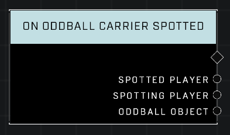

# On Oddball Carrier Spotted

## Description
Event called whenever a player carrying the Oddball has been spotted. This event only fires in modes that allow hiding and spotting of the Oddball Carrier.

## Node Type
Nodes fall into two basic categories: Data and Execution. This node listens for an Event, then triggers it's node string.

## Inputs
| Input | Type | Required | Description |
|------------------|------------------|----------|--------------------------------------------------------------|
| N/A | N/A | N/A | |

## Outputs
| Output | Type | Description |
|------------------|------------------|--------------------------------------------------------------|
| Spotted Player | Object | Which player was spotted as they were carrying the oddball.|
| Spotting Player | Object | Which player saw the carrier.|
| Oddball Object | Object | The oddball player was carrying when they were spotted.|

\
\
**Contributors**

AddiCt3d 2CHa0s