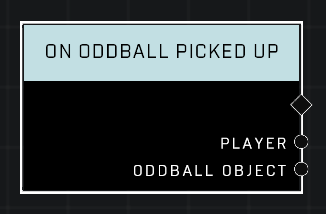

# On Oddball Picked Up

## Description
Event called whenever a player carrying the Oddball has picked up the Oddball. Event also fires whenever a player is given the Oddball.

## Node Type
Nodes fall into two basic categories: Data and Execution. This node listens for an Event, then triggers it's node string.

## Inputs
| Input | Type | Required | Description |
|------------------|------------------|----------|--------------------------------------------------------------|
| N/A | N/A | N/A | |

## Outputs
| Output | Type | Description |
|------------------|------------------|--------------------------------------------------------------|
| Player | Object | Which player was just picked up the oddball.|
| Oddball Object | Object | The oddball that was picked up.|

\
\
**Contributors**

AddiCt3d 2CHa0s