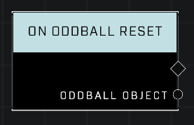

# On Oddball Reset

## Description
Event called whenever the Oddball has been dropped for long enough to trigger the Oddball reset

## Node Type
Nodes fall into two basic categories: Data and Execution. This node listens for an Event, then triggers it's node string.

## Inputs
| Input | Type | Required | Description |
|------------------|------------------|----------|--------------------------------------------------------------|
| N/A | N/A | N/A | |

## Outputs
| Output | Type | Description |
|------------------|------------------|--------------------------------------------------------------|
| Oddball Object | Object | The oddball that was reset.|

\
\
**Contributors**

AddiCt3d 2CHa0s