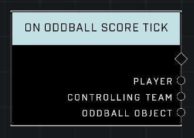

# On Oddball Score Tick

## Description
Event called every interval after the Oddball object is picked up and the Player scores a point. The interval is in seconds. This node only works in Oddball game modes.

## Node Type
Nodes fall into two basic categories: Data and Execution. This node listens for an Event, then triggers it's node string.

## Inputs
| Input | Type | Required | Description |
|------------------|------------------|----------|--------------------------------------------------------------|
| N/A | N/A | N/A | |

## Outputs
| Output | Type | Description |
|------------------|------------------|--------------------------------------------------------------|
| Player | Object | Which player is currently holding the Oddball.|
| Controlling Team | Team | Which team the Oddball carrier is on.|
| Oddball Object | Object | The oddball that is scoring.|

\
\
**Contributors**

AddiCt3d 2CHa0s