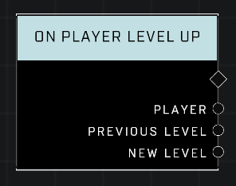

# On Player Level Up

## Description
Event called when any player levels up during specific game modes

## Node Type
Nodes fall into two basic categories: Data and Execution. This node listens for an Event, then triggers it's node string.

## Inputs
| Input | Type | Required | Description |
|------------------|------------------|----------|--------------------------------------------------------------|
| N/A | N/A | N/A | |

## Outputs
| Output | Type | Description |
|------------------|------------------|--------------------------------------------------------------|
| Player | Object | The player who has leveled up.|
| Previous Level | | Player's level before they leveled up.|
| New Level | | Player's current level.|

\
\
**Contributors**

AddiCt3d 2CHa0s