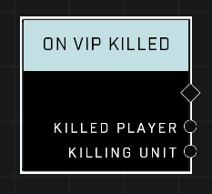

# On VIP Killed

## Description
Event called when a VIP is killed

## Node Type
Nodes fall into two basic categories: Data and Execution. This node listens for an Event, then triggers it's node string.

## Inputs
| Input | Type | Required | Description |
|------------------|------------------|----------|--------------------------------------------------------------|
| N/A | N/A | N/A | |

## Outputs
| Output | Type | Description |
|------------------|------------------|--------------------------------------------------------------|
| Killed Player | Object | The VIP player who was just killed.|
| Killing Unit | Object | The player who killed the VIP.|

\
\
**Contributors**

AddiCt3d 2CHa0s