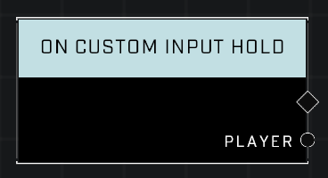

# On Custom Input Hold

## Description
Event called when any player has held the custom input for a brief period of time.  

## Node Type
Nodes fall into two basic categories: Data and Execution. This node listens for an Event, then triggers it's node string.

## Inputs
| Input | Type | Required | Description |
|------------------|------------------|----------|--------------------------------------------------------------|
| N/A | N/A | N/A | |

## Outputs
| Output | Type | Description |
|------------------|------------------|--------------------------------------------------------------|
| Player | Object | The player who is holding custom input. |

\
\
**Contributors**

AddiCt3d 2CHa0s \
Okom \
Jordan9232

