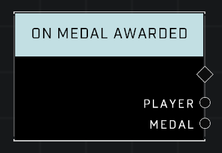

# On Medal Awarded

## Description
Event called when a medal is awarded to Player

## Node Type
Nodes fall into two basic categories: Data and Execution. This node listens for an Event, then triggers it's node string.

## Inputs
| Input | Type | Required | Description |
|------------------|------------------|----------|--------------------------------------------------------------|
| N/A | N/A | N/A | |

## Outputs
| Output | Type | Description |
|------------------|------------------|--------------------------------------------------------------|
| Player | Object | The player who has received a medal. |
| Medal | Medal | Which medal player received. |

\
\
**Contributors**

AddiCt3d 2CHa0s