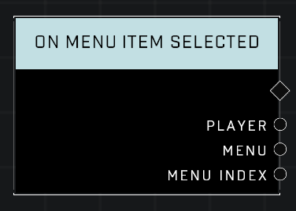

# On Menu Item Selected

## Description
Event called when any _Player_ triggers a _Menu Item_.  

## Node Type
Nodes fall into two basic categories: Data and Execution. This node listens for an Event, then triggers it's node string.

## Inputs
| Input | Type | Required | Description |
|------------------|------------------|----------|--------------------------------------------------------------|
| N/A | N/A | N/A | |

## Outputs
| Output | Type | Description |
|------------------|------------------|--------------------------------------------------------------|
| Player | Object | The player who selected an item on the menu. |
| Menu | Menu | Which Menu was player selected an item on. |
| Menu Index | Menu Index | The index of the Menu item. |

\
\
**Contributors**

AddiCt3d 2CHa0s \
Okom \
Jordan9232

