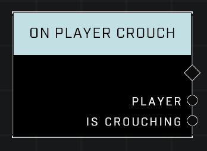

# On Player Crouch

## Description
Event called when any player changes their crouch state. Is Crouching will be true when a player crouches and false when they stand back up.

## Node Type
Nodes fall into two basic categories: Data and Execution. This node listens for an Event, then triggers it's node string.

## Inputs
| Input | Type | Required | Description |
|------------------|------------------|----------|--------------------------------------------------------------|
| N/A | N/A | N/A | |

## Outputs
| Output | Type | Description |
|------------------|------------------|--------------------------------------------------------------|
| Player | Object | The player who has changed their crouch state. |
| Is Crouching | Boolean | TRUE when player has crouched, FALSE when player stands up. |

\
\
**Contributors**

AddiCt3d 2CHa0s