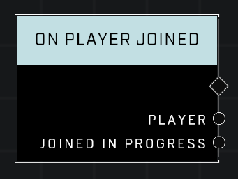

# On Player Joined

## Description
Event called when a player has joined and is acive in the game. Joined In Progress will be true if the match had already started when the player joined.

## Node Type
Nodes fall into two basic categories: Data and Execution. This node listens for an Event, then triggers it's node string.

## Inputs
| Input | Type | Required | Description |
|------------------|------------------|----------|--------------------------------------------------------------|
| N/A | N/A | N/A | |

## Outputs
| Output | Type | Description |
|------------------|------------------|--------------------------------------------------------------|
| Player | Object | The player who has joined the game. |
| Joined In Progress | Boolean | TRUE if player joins when the game has already started. |

\
\
**Contributors**

AddiCt3d 2CHa0s