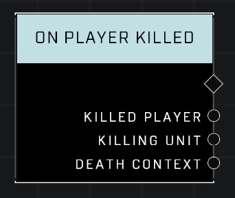

# On Player Killed

## Description
Event called when any player dies

## Node Type
Nodes fall into two basic categories: Data and Execution. This node listens for an Event, then triggers it's node string.

## Inputs
| Input | Type | Required | Description |
|------------------|------------------|----------|--------------------------------------------------------------|
| N/A | N/A | N/A | |

## Outputs
| Output | Type | Description |
|------------------|------------------|--------------------------------------------------------------|
| Killed Player | Object | The player who was just killed.|
| Killing Unit | Object | The unit who killed the player.|
| Death Context | Death Context | Includes information like what weapon was used, etc (see Death Context page)

## Learn More About This Node
While the name of the node suggests that it covers all forms of death, this is not the case. It is important for scripters to be aware of these limitations to avoid any unintended consequences.

One of the main limitations is that there is no equivalent 'On Player Died' node. For instance: changing teams while alive in the game results in a player respawn instead of death, which can be a source of confusion for scripters as they don't look different from the player's perspective.

Specifically, it will only trigger for certain causes of death, such as being killed by another player's weapon. It does not trigger for deaths caused by environmental hazards, such as falling from a great height or drowning.

It is important to keep these limitations in mind when designing scripts that involve player death.

\
\
**Contributors**

Captain Punch\
AddiCt3d 2CHa0s
