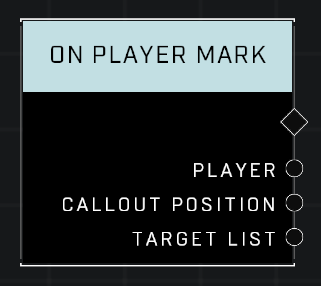

# On Player Mark

## Description
Event called when a player pings an object within range using the Mark system. Targest List returns an object list with any dynamic objects the callout hits and will return an empty list if there are no valid targets.

## Node Type
Nodes fall into two basic categories: Data and Execution. This node listens for an Event, then triggers it's node string.

## Inputs
| Input | Type | Required | Description |
|------------------|------------------|----------|--------------------------------------------------------------|
| N/A | N/A | N/A | |

## Outputs
| Output | Type | Description |
|------------------|------------------|--------------------------------------------------------------|
| Player | Object | The player who marked. |
| Callout Position | Vector3 | Location of the Mark icon. |
| Target List | Object List | All dynamic objects in range of the Mark. |

\
\
**Contributors**

AddiCt3d 2CHa0s

