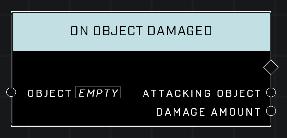

# On Object Damaged

## Description
Event called when the Object is damaged by any source. This event won't trigger when Players, or objects that don't have health values, are used as the object referenced.

## Node Type
Nodes fall into two basic categories: Data and Execution. This Execution node fires when something happens in the game that triggers it, and starts off the node string.

## Inputs
| Input            | Type             | Required | Description												    |
|------------------|------------------|----------|--------------------------------------------------------------|
| Object | Object  | Yes | Which Object to monitor damage for. |

## Outputs
| Output           | Type             | Description												     |
|------------------|------------------|--------------------------------------------------------------|
| Attacking Object | Object  | Which object is attacking this object. |
| Damage Amount | Number  | How much damage the attack did on the object. |

\
\
**Contributors**

AddiCt3d 2CHa0s