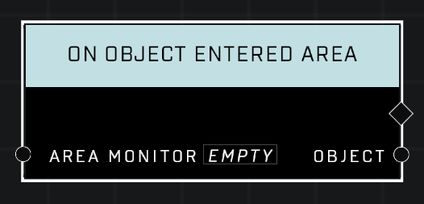

# On Object Entered Area

## Description
Event called when an object enters the Area Monitor's boundary. Returns which object has entered the boundary.

## Node Type
Nodes fall into two basic categories: Data and Execution. This Execution node fires when something happens in the game that triggers it, and starts off the node string.

## Inputs
| Input            | Type             | Required | Description												    |
|------------------|------------------|----------|--------------------------------------------------------------|
| Area Monitor | Area Monitor  | Yes | The Area Monitor to check when objects enter. |

## Outputs
| Output           | Type             | Description												     |
|------------------|------------------|--------------------------------------------------------------|
| Object | Object | Which object entered the Area Monitor.  |

\
\
**Contributors**

AddiCt3d 2CHa0s