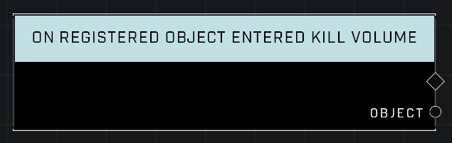

# On Registered Object Entered Kill Volume

## Description
Event called when an object registered through nodegraph enters a Kill Volume's boundary.

## Node Type
Nodes fall into two basic categories: Data and Execution. This Execution node fires when something happens in the game that triggers it, and starts off the node string.

## Inputs
| Input            | Type             | Required | Description												    |
|------------------|------------------|----------|--------------------------------------------------------------|
| (none) | N/A  | N/A  | |

## Outputs
| Output           | Type             | Description												     |
|------------------|------------------|--------------------------------------------------------------|
| Object | Object  | The Object that was detected entering a Kill Volume.  |

\
\
**Contributors**

AddiCt3d 2CHa0s \
Okom