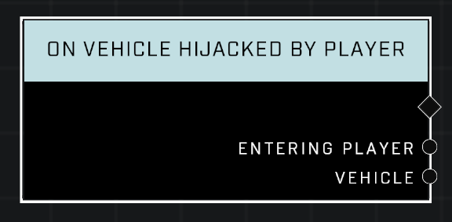

# On Vehicle Hijacked By Player

## Description
Event called when a player hijacks a vehicle

## Node Type
Nodes fall into two basic categories: Data and Execution. This Execution node fires when something happens in the game that triggers it, and starts off the node string.

## Inputs
| Input            | Type             | Required | Description												    |
|------------------|------------------|----------|--------------------------------------------------------------|
| (none) | N/A  | N/A  | |

## Outputs
| Output           | Type             | Description												     |
|------------------|------------------|--------------------------------------------------------------|
| Entering Player | Object  | Which player has hijacked the vehicle. |
| Vehicle | Object  | Which vehicle was hijacked. |

\
\
**Contributors**

AddiCt3d 2CHa0s