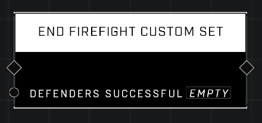

# End Firefight Custom Set

## Description
Ends the currently running Firefight Custom Set. THe defending (Eagle) team will gain a point if Defenders Successful is TRUE; otherwise, Cobra will earn a point. Only works in Firefight Custom. If called between Sets, will have no effect.

## Node Type
Nodes fall into two basic categories: Data and Execution. This node Executes a function directly in the node string.

## Inputs
| Input | Type | Required | Description |
|------------------|------------------|----------|--------------------------------------------------------------|
| Defenders Successful | Boolean | Yes | Sets whether or not defence or offense will get a point. |

## Outputs
| Output | Type | Description |
|------------------|------------------|--------------------------------------------------------------|
| N/A | N/A | N/A | |

\
\
**Contributors**

AddiCt3d 2CHa0s