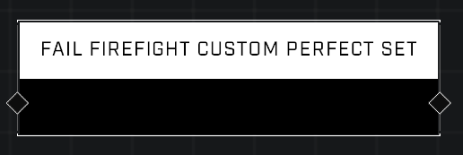

# Fail Firefight Custom Perfect Set

## Description
Causes the defending (Eagle) team in the Firefight variant to fail their perfect Set, preventing them from earning Skulls after the Set completes. Only works in Firefight Custom when dynamic Skulls are enabled.

## Node Type
Nodes fall into two basic categories: Data and Execution. This node Executes a function directly in the node string.

## Inputs
| Input | Type | Required | Description |
|------------------|------------------|----------|--------------------------------------------------------------|
| N/A | N/A | N/A | |

## Outputs
| Output | Type | Description |
|------------------|------------------|--------------------------------------------------------------|
| N/A | N/A | N/A |

\
\
**Contributors**

AddiCt3d 2CHa0s