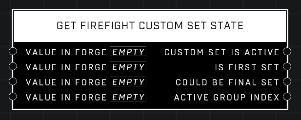

# Get Firefight Custom Set State

## Description
Returns information about the currently running Firefight Custom Set. If no Custom Set is active, Custom Set Active will be FALSE and 1 as appropriate. Input pins determine the value in Forge to facilitate script testing. Only works in Firefight Custom.

## Node Type
Nodes fall into two basic categories: Data and Execution. This node supplies Data for an Execution node.

## Inputs
| Input | Type | Required | Description |
|------------------|------------------|----------|--------------------------------------------------------------|
| Value In Forge | Boolean | Yes | Sets if "Custom Set Is Active" should be true or false when testing in Forge |
| Value In Forge | Boolean | Yes | Sets if "Is First Set" should be true or false when testing in Forge |
| Value In Forge | Boolean | Yes | Sets if "Could Be Final Set" should be true or false when testing in Forge |
| Value In Forge | Number | Yes | Sets which "Group Index" should be detected as active in Forge |

## Outputs
| Output | Type | Description |
|------------------|------------------|--------------------------------------------------------------|
| Custom Set Is Active | Boolean | Which Custom Set is currently active.|
| Is First Set | Boolean | Is TRUE if current custom set is the first set. |
| Could Be Final Set | Boolean | Is TRUE if current custom set could be the final set.  |
| Active Group Index | Number | Which Group Index is currently active. |

\
\
**Contributors**

AddiCt3d 2CHa0s