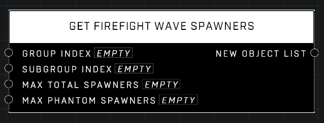

# Get Firefight Wave Spawners

## Description
Returns a randomly ordered Object List of AI Spawner objects that have the Firefight Spawner game mode label, a matching Group Index, and a matching Subgroup Index. List contents will be filtered to first provide Phantom spawners up to the max, and then the reset from all other spawner types. Only returns up to 32 spawners. Works in all game modes.

## Node Type
Nodes fall into two basic categories: Data and Execution. This node supplies Data for an Execution node.

## Inputs
| Input | Type | Required | Description |
|------------------|------------------|----------|--------------------------------------------------------------|
| Group Index | Number | Yes | Which Group Index to get spawners from (see Group Index page). |
| Subgroup Index | Number | Yes | Which Subgroup Index to get spawners from. |
| Max Total Spawners| Number | Yes | Max total that will output into the list. |
| Max Phantom Spawners| Number | Yes | Max Phantom Spawners that will output into the list before adding other spawners. |

## Outputs
| Output | Type | Description |
|------------------|------------------|--------------------------------------------------------------|
| New Object List | Object List | List of AI spawners filtered using the input pins. |

\
\
**Contributors**

AddiCt3d 2CHa0s