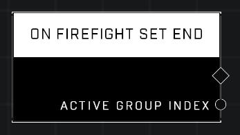

# On Firefight Set End

## Description
Event called when any Firefight game variant ends a Set. Returns the Group Index the Set was launched with, which determines which spawners and objectives were triggered for that Set. Only works in Firefight variants.

## Node Type
Nodes fall into two basic categories: Data and Execution. This node listens for an Event, then triggers it's node string.

## Inputs
| Input | Type | Required | Description |
|------------------|------------------|----------|--------------------------------------------------------------|
| N/A | N/A | N/A | |

## Outputs
| Output | Type | Description |
|------------------|------------------|--------------------------------------------------------------|
| Active Group Index | Number | Which Group Index is currently active. |

\
\
**Contributors**

AddiCt3d 2CHa0s