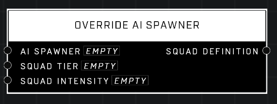

# Override AI Spawner

## Description
Overrides the units on the given AI Spawner spawner with a squad definition from the Firefight enemy tables. Higher Difficulty and/or higher Intensity will produce harder squads. Works in any game mode.

## Node Type
Nodes fall into two basic categories: Data and Execution. This node listens for an Event, then triggers it's node string.

## Inputs
| Input | Type | Required | Description |
|------------------|------------------|----------|--------------------------------------------------------------|
| AI Spawner | AI Spawner | Yes | Which AI Spawner to override. |
| Squad Tier | Number | Yes | Squad health and damage level (1-5) |
| Squad Intensity | Number | Yes | Squad attack level (1-3) |

## Outputs
| Output | Type | Description |
|------------------|------------------|--------------------------------------------------------------|
| Squad Definition | Squad Definition | New squad definition for the AI Spawner in the input pin. |

\
\
**Contributors**

AddiCt3d 2CHa0s