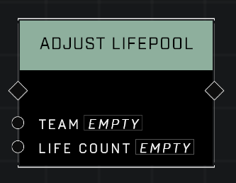

# Adjust Lifepool

## Description
Adjusts the *Team*'s lifepool by the provided *Life Count*, if teams and lifepools are enabled. Negative values will subtract lives.

## Node Type
Nodes fall into two basic categories: Data and Execution. This node Executes a function directly in the node string.

## Inputs
| Input | Type | Required | Description |
|------------------|------------------|----------|--------------------------------------------------------------|
| Team | Team | Yes | The team whose lifepool will change. |
| Life Count | Number | Yes | Adds this number to team's current Lifepool. |

## Outputs
| Output | Type | Description |
|------------------|------------------|--------------------------------------------------------------|
| N/A | N/A | N/A | |

\
\
**Contributors**

AddiCt3d 2CHa0s
