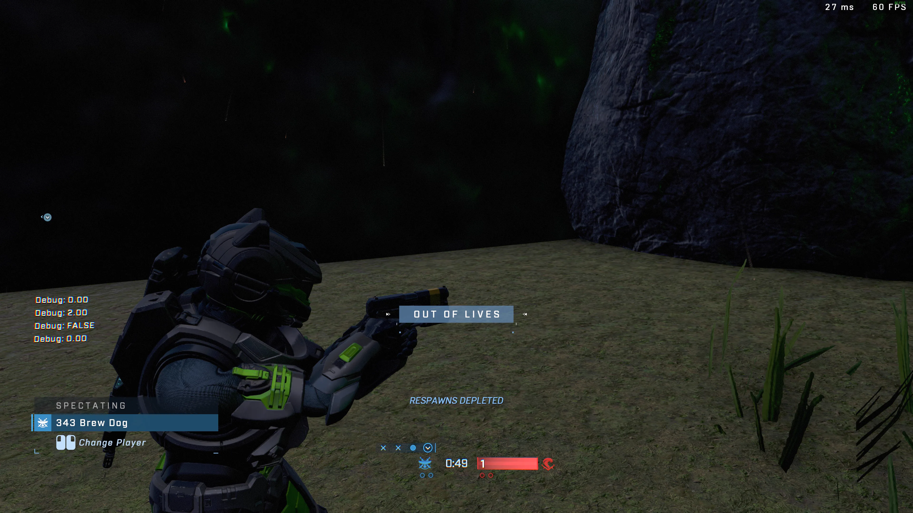

# Adjust Lifepool

<figure><figcaption></figcaption></figure>

The [Adjust Lifepool](adjust-lifepool.md) node allows for the dynamic management of a team's available lives, which is essential for controlling respawn cycles.

## Description

Adjusts the *[Team](../variables-basic/team.md)*'s lifepool by the provided *Life Count*, if teams and lifepools are enabled. Negative values will subtract lives.

<figure><figcaption>
The Adjust Lifepool node is integrated into a workflow to modify team lives.
</figcaption></figure>

<figure><figcaption>
The interface displays a message indicating that respawns are depleted.
</figcaption></figure>


The video shows the node successfully adjusting a team's lifepool in Firefight mode.



This node may be unreliable in Attrition or Slayer modes, where it might fail to adjust the lifepool or control respawns. It is most effective in Firefight-based modes, though it may occasionally affect more than one team at a time.


## Node Type

Nodes fall into two basic categories: Data and Execution. This node Executes a function directly in the node string.

## Inputs

| Input | Type | Required | Description |
|------------------|------------------|----------|--------------------------------------------------------|
| `Team` | `Team` | Yes | The team whose lifepool will change. |
| Life Count | [Number](../variables-basic/number.md) | Yes | Adds this number to team's current Lifepool. |

## Outputs

| Output | Type | Description |
|------------------|------------------|--------------------------------------------------------------|
| N/A | N/A | N/A | |
## Source Data

* Discord thread: [Need Help with 'Adjust Lifepool' Node](https://discord.com/channels/220766496635224065/1347303298050560112/1347303298050560112)

#### <mark style="color:green;">Contributors</mark>

AddiCt3d 2CHa0s\
Skisma\
Okom\
Dj_HurstyDNB\
Renette\
Digiace/Luez\
Josh