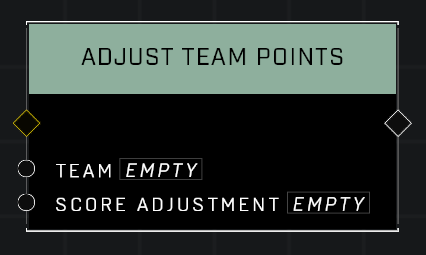

# Adjust Team Points

## Description
Adjusts the point total of the *Team* for current round by the *Score Adjustment* amount. Negative values will subtract points.

## Node Type
Nodes fall into two basic categories: Data and Execution. This node Executes a function directly in the node string.

## Inputs
| Input | Type | Required | Description |
|------------------|------------------|----------|--------------------------------------------------------------|
| Team | Team | Yes | The team whose points will change. |
| Score Adjustment | Number | Yes | Adds this number to team's points. |

## Outputs
| Output | Type | Description |
|------------------|------------------|--------------------------------------------------------------|
| N/A | N/A | N/A |

\
\
**Contributors**

AddiCt3d 2CHa0s