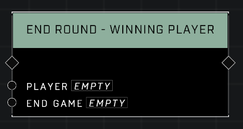

# End Round - Winning Player

## Description
Ends the current round immediately, recording a win for the *Player* regardless of score. If *End Game* is set to true, the game will end regardless of how many rounds were remaining.

## Node Type
Nodes fall into two basic categories: Data and Execution. This node Executes a function directly in the node string.

## Inputs
| Input | Type | Required | Description |
|------------------|------------------|----------|--------------------------------------------------------------|
| Player | Player | Yes | Which player gets credit for the win. |
| End Game | Boolean | Yes | Whether or not the game will also end. |

## Outputs
| Output | Type | Description |
|------------------|------------------|--------------------------------------------------------------|
| N/A | N/A | N/A |

\
\
**Contributors**

AddiCt3d 2CHa0s