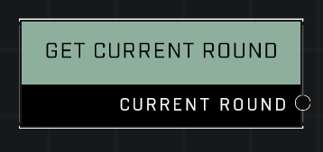

# Get Current Round

## Description
Gets the current round number

## Node Type
Nodes fall into two basic categories: Data and Execution. This node supplies Data for an Execution node.

## Inputs
| Input | Type | Required | Description |
|------------------|------------------|----------|--------------------------------------------------------------|
| N/A | N/A | N/A | |

## Outputs
| Output | Type | Description |
|------------------|------------------|--------------------------------------------------------------|
| Current Round | Number | Which round game is in. |

\
\
**Contributors**

AddiCt3d 2CHa0s