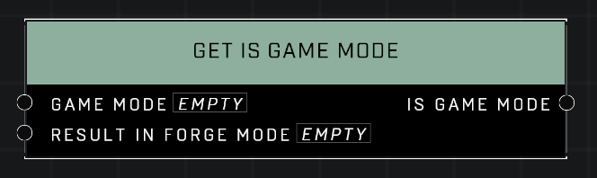

# Get Is Game Mode

## Description
Returns true if the *Game Mode* input matches the curently running game mode. The second pin determines the behavior in Forge Mode for testing.

## Node Type
Nodes fall into two basic categories: Data and Execution. This node supplies Data for an Execution node.

## Inputs
| Input | Type | Required | Description |
|------------------|------------------|----------|--------------------------------------------------------------|
| Game Mode | Game Mode | Yes | What gametype current game is (See Game Mode page). |
| Result In Forge Mode | Boolean | Yes | Whether or not this debug prints in Forge. |

## Outputs
| Output | Type | Description |
|------------------|------------------|--------------------------------------------------------------|
| Is Game Mode | Boolean | TRUE when current gametype matches Game Mode input. |

\
\
**Contributors**

AddiCt3d 2CHa0s