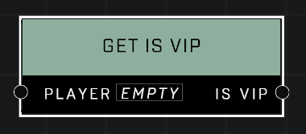

# Get Is VIP

## Description
Returns true if the *Player* is a VIP

## Node Type
Nodes fall into two basic categories: Data and Execution. This node supplies Data for an Execution node.

## Inputs
| Input | Type | Required | Description |
|------------------|------------------|----------|--------------------------------------------------------------|
| Player | Player | Yes | Which player to check if they're VIP. |

## Outputs
| Output | Type | Description |
|------------------|------------------|--------------------------------------------------------------|
| Is VIP | Boolean | TRUE when player in input pin is a VIP. |

\
\
**Contributors**

AddiCt3d 2CHa0s