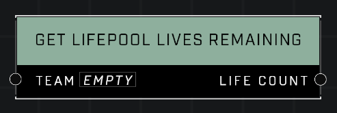

# Get Lifepool Lives Remaining

## Description
Returns the number of lives remaining for *Team*

## Node Type
Nodes fall into two basic categories: Data and Execution. This node supplies Data for an Execution node.

## Inputs
| Input | Type | Required | Description |
|------------------|------------------|----------|--------------------------------------------------------------|
| Team | Team | Yes | Which player to check Lifepool for. |

## Outputs
| Output | Type | Description |
|------------------|------------------|--------------------------------------------------------------|
| Life Count | Number | How many lives the team has. |

\
\
**Contributors**

AddiCt3d 2CHa0s