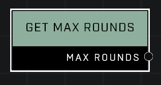

# Get Max Rounds

## Description
Returns true if the game is currently Forge mode. Will return false in custom games. Use for debugging purposes.

## Node Type
Nodes fall into two basic categories: Data and Execution. This node supplies Data for an Execution node.

## Inputs
| Input | Type | Required | Description |
|------------------|------------------|----------|--------------------------------------------------------------|
| N/A | N/A | N/A | |

## Outputs
| Output | Type | Description |
|------------------|------------------|--------------------------------------------------------------|
| Max Rounds | Number | Maximum rounds that will run before the game will end. |

\
\
**Contributors**

AddiCt3d 2CHa0s