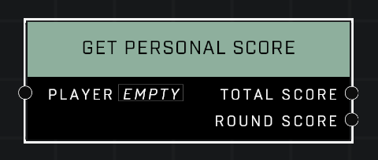

# Get Personal Score

## Description
Gets the *Player* Personal Score, which affects placement order in the scoreboard, among other things. Provides Personal Score for the current round as well as the whole match. Use **Get Player Points** if you want to measure progress to victory.

## Node Type
Nodes fall into two basic categories: Data and Execution. This node supplies Data for an Execution node.

## Inputs
| Input | Type | Required | Description |
|------------------|------------------|----------|--------------------------------------------------------------|
| Player | Player | Yes | Which player to check Personal Score for. |

## Outputs
| Output | Type | Description |
|------------------|------------------|--------------------------------------------------------------|
| Total Score | Number | The player's total score in the game so far. |
| Round Score | Number | The player's score accumulated in current round only. |

\
\
**Contributors**

AddiCt3d 2CHa0s