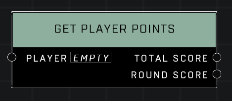

# Get Player Points

## Description
Gets the *Player*'s point total. Provides points for the current round as well as the whole match.

## Node Type
Nodes fall into two basic categories: Data and Execution. This node supplies Data for an Execution node.

## Inputs
| Input | Type | Required | Description |
|------------------|------------------|----------|--------------------------------------------------------------|
| Player | Player | Yes | Which player to check Player Points for. |

## Outputs
| Output | Type | Description |
|------------------|------------------|--------------------------------------------------------------|
| Total Score | Number | Total Player Points accumulated in the game so far. |
| Round Score | Number | Player Points accumulated so far in current round only. |

\
\
**Contributors**

AddiCt3d 2CHa0s