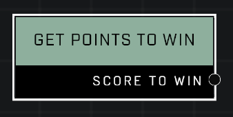

# Get Points To Win

## Description
Gets the point total needed to win the current round

## Node Type
Nodes fall into two basic categories: Data and Execution. This node supplies Data for an Execution node.

## Inputs
| Input | Type | Required | Description |
|------------------|------------------|----------|--------------------------------------------------------------|
| N/A | N/A | N/A | |

## Outputs
| Output | Type | Description |
|------------------|------------------|--------------------------------------------------------------|
| Score To Win | Number | How many points will win the round. |

\
\
**Contributors**

AddiCt3d 2CHa0s