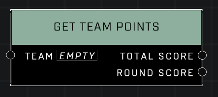

# Get Team Points

## Description
Gets the point total for the *Team*. Returns points for the current round as well as the whole match.

## Node Type
Nodes fall into two basic categories: Data and Execution. This node supplies Data for an Execution node.

## Inputs
| Input | Type | Required | Description |
|------------------|------------------|----------|--------------------------------------------------------------|
| Team | Team | Yes | The team to check Points for. |

## Outputs
| Output | Type | Description |
|------------------|------------------|--------------------------------------------------------------|
| Total Score | Number | The teams's total score in the game so far. |
| Round Score | Number | The team's score accumulated in current round only. |

\
\
**Contributors**

AddiCt3d 2CHa0s