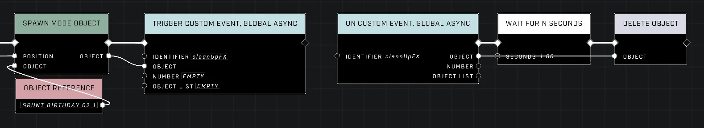

# Spawn Mode Object test

<figure><figcaption></figcaption></figure>

The [Spawn Mode Object](spawn-mode-object.md) node is used to create clones of objects from a Forge Mode or during level scripting, preserving most properties of the original object. This makes it an alternative for creating duplicates that maintain specific configurations like physics and spawn order.

## Spawning Mechanics and Property Retention

When using this node by feeding in an `Object` and a `Position`, the system creates a clone of the input at the specified location. It is noted that the source must be an object created naturally, as it cannot be used on an already cloned object. 

### Copied Properties and Limitations

While many properties are successfully transferred to the new instance—including physics settings, spawn order, and generic spawner/AI Spawner or Generic Zone configurations—not all attributes are copied. For example, colors from the dynamic material system do not transfer, resulting in clones that lack the original object's specific materials.

## Managing Object Instances

In Forge, it is useful to distinguish between a "spawner" and an "instance." Every dynamic object acts as a spawner that creates an instance of itself at its transform with designated properties. The `Spawn Mode Object` node functions by firing the existing spawner again to create another instance. Because these instances share internal data from the original, using [Are Same Object](../objects/are-same-object.md) on two different spawned instances will result in them being identified as the same object.


Instances created via this node are not unique spawners; they carry and reference the internal data of the source spawner.


#### Referencing Clones and Deletion Tasks

When working with multiple instances, standard variable usage can lead to referencing the original spawner rather than the specific clone. To store or fetch a particular instance in an [Object Variable](../variables-advanced/object-variable.md) or [Object List Variable](../variables-advanced/object-list-variable.md), users should use the `Get Object Without Refresh` or `Get Object List Without Refresh` nodes. Alternatively, the object pin value from the node itself can be passed directly into a custom event to maintain a reference to that specific instance.

Reliable deletion of these temporary instances is not always guaranteed. In some cases, it may be necessary to use an [Async Custom Event](../events-custom/trigger-custom-event-global-async.md) with a delay to ensure the object is properly removed after spawning.

<figure><figcaption></figcaption></figure>

## Comparison with Clone Object Node

Whether to use `Spawn Mode Object` or the standard [Clone Object](../objects/clone-object.md) node depends on whether property retention is required:

* **Use `Spawn Mode Object`** if you need clones that inherit specific properties like spawn order and physics.
* **Use `Clone Object`** if a default version of the object type is sufficient, as these create entirely new spawner objects. This avoids issues with shared instance data; for example, when assigning copies to separate players, damaging one `Spawn Mode Object` instance can sometimes damage all other instances in the chain, whereas `Clone Object` results remain independent.

***

## Source Data

* Discord thread: [Spawn Mode Object](https://discord.com/channels/220766496635224065/1535554632825311262/1535554632825311262)

#### <mark style="color:green;">Contributors</mark>

Okom