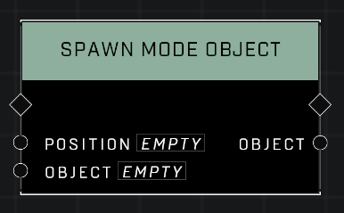

# Spawn Mode Object

## Description
Spawn dynamic object from a Mode Brain. Objects referenced using the Object Reference node must be included into the mode prefab.

## Node Type
Nodes fall into two basic categories: Data and Execution. This node Executes a function directly in the node string.

## Inputs
| Input | Type | Required | Description |
|------------------|------------------|----------|--------------------------------------------------------------|
| Position | Vector3 | Yes | Where in the world the object will spawn. |
| Object | Object | Yes | Which object to spawn. |

## Outputs
| Output | Type | Description |
|------------------|------------------|--------------------------------------------------------------|
| N/A | N/A | N/A |

\
\
**Contributors**

AddiCt3d 2CHa0s \
Okom \
Jordan9232