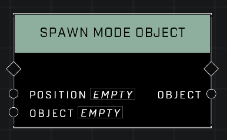

# Spawn Mode Object

<figure><figcaption></figcaption></figure>

This node spawns copies of objects by firing an existing "spawner," creating new instances that inherit most properties from the original object. While primarily intended to spawn clones for a Forge Mode prefab, it can also be used in general level scripting to create object instances with specific behaviors preserved.

## Description
Spawns dynamic objects based on their source spawner settings. When using this node within a Mode Prefab, any objects referenced via an `Object Reference` node must be included in the Mode Prefab brains. The node can also function during standard level scripting without being part of a loaded Forge Mode.

## Node Type
Nodes fall into two basic categories: Data and Execution. This node Executes a function directly in the node string.

## Inputs
| Input | Type | Required | Description |
|------------------|------------------|----------|--------------------------------------------------------------|
| Position | Vector3 | Yes | Where in the world the object will spawn. |
| Object | Object | Yes | Which object to spawn (the source spawner). |

## Outputs
| Output | Type | Description |
|------------------|------------------|--------------------------------------------------------------|
| Object | Object | Cloned object instance

## Spawners vs. Instances
To understand this node, it is necessary to distinguish between a "spawner" and an "instance":
* **Spawner:** Every dynamic object present on the map from the start acts as a spawner—an internal data set containing properties intended to create an object at a specific transform.
* **Instance:** The actual object created by the spawner at that transform.

The `Spawn Mode Object` node works by firing the original object's spawner again to produce another instance. Because these instances share the same underlying internal data as the original, using [Are Same Object](../objects/are-same-object.md) on two different instances of the same source will return true, as they are recognized as being derived from the same spawner.

 You cannot use the `Spawn Mode Object` node on an already cloned object; it must be used on an object that was created naturally in the scene, as the clones are instances instead of spawners. 

## Properties and Limitations
Because implementation focused on ensuring core features like AI Spawners and Generic Zones function correctly, not all properties are inherited by the created instance. 

* **Retained properties:** Physics settings, spawn order, spawn properties, advanced properties, and others.
* **Lost properties:** At least the dynamic material system (materials and colors).

## Referencing Spawned Objects
Managing multiple spawned objects requires care when storing them in variables:

* **Using Variables:** To fetch these clones from an [Object Variable](../variables-advanced/object-variable.md) or [Object List Variable](../variables-advanced/object-list-variable.md), you must use [Get Object Variable Without Refresh](../variables-advanced/object-variable.md#get-object-variable-without-refresh) or [Get Object List Variable Without Refresh](../variables-advanced/object-list-variable.md#get-object-list-variable-without-refresh). These nodes specifically reference the created object instances. 
  * *Note:* Using a standard [Get Object Variable](../variables-advanced/object-variable.md#get-object-variable) node will fetch the original spawner rather than the spawned instance.
* **Direct Referencing:** You can carry the `Object` pin value directly from the `Spawn Mode Object` node into an event or subsequent chain to maintain a reference to that specific instance.

 The `Object` output of this node will always refer to the most recently spawned instance of that object, rather than necessarily the one created by a specific execution of the node. This can cause issues when attempting to handle multiple instances simultaneously in parallel scripts (e.g., if an Async Event spawns and then attempts to delete the object after a delay). 

## When to use Clone Object instead
The standard [Clone Object](../objects/clone-object.md) node creates entirely new, default spawner objects with no custom properties carried over. 

Use `Clone Object` if you require independent spawners for every copy. This is particularly important when assigning clones to different players; because `Spawn Mode Object` instances share internal data, certain scripted functions—such as applying damage—can behave inconsistently (e.g., damaging one instance might inadvertently affect others). However: adjusting the position of individual `Spawn Mode Object` instances still works correctly on a per-object basis.

## Cleanup
Because the deletion of spawned instances is not always reliable, it is sometimes necessary to use a cleanup script. A common method is using an [Async Custom Event](../events-custom/trigger-custom-event-global-async.md) that receives the object instance and deletes it after a short delay. Optionally multiple deletions of the same object can be added in the same event to ensure the object gets deleted.

<figure><figcaption></figcaption></figure>

***

## Source Data

* Discord thread: [Spawn Mode Object](https://discord.com/channels/220766496635224065/1535554632825311262/1535554632825311262)

#### <mark style="color:green;">Contributors</mark>

AddiCt3d 2CHa0s\
Okom\
Jordan9232\
MadmanEpic
