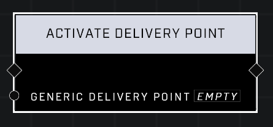

# Activate Delivery Point

## Description
Activates the *Delivery Point*, causing it to spawn. The object does not have to set the Triggered By Script property to use this node.

## Node Type
Nodes fall into two basic categories: Data and Execution. This node Executes a function directly in the node string.

## Inputs
| Input | Type | Required | Description |
|------------------|------------------|----------|--------------------------------------------------------------|
| Generic Delivery Point | Object | Yes | Which Generic Delivery Point will be activated. |

## Outputs
| Output | Type | Description |
|------------------|------------------|--------------------------------------------------------------|
| N/A | N/A | N/A |

\
\
**Contributors**

AddiCt3d 2CHa0s

