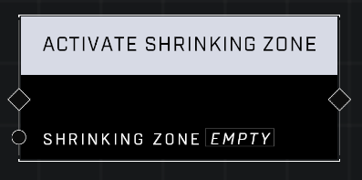

# Activate Shrinking Zone

## Description
Activates the designated Shrinking Zone sequence. Delays set in the object properties will execute when the zone is triggered.

## Node Type
Nodes fall into two basic categories: Data and Execution. This node Executes a function directly in the node string.

## Inputs
| Input | Type | Required | Description |
|------------------|------------------|----------|--------------------------------------------------------------|
| Generic Shrinking Zone | Object | Yes | Which Generic Shrinking Zone will be activated. |

## Outputs
| Output | Type | Description |
|------------------|------------------|--------------------------------------------------------------|
| N/A | N/A | N/A |

\
\
**Contributors**

AddiCt3d 2CHa0s