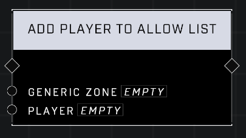

# Add Player To Allow List

## Description
Adds player to the Generic Zone's Allow List which determines who is able to capture the zone. This only works if the Generic Zone's Restrict Capture property is set to Allow List.

## Node Type
Nodes fall into two basic categories: Data and Execution. This node Executes a function directly in the node string.

## Inputs
| Input | Type | Required | Description |
|------------------|------------------|----------|--------------------------------------------------------------|
| Generic Zone | Object | Yes | Which Generic Zone to add player to |
| Player | Object | Yes | Which player to add to the list. |

## Outputs
| Output | Type | Description |
|------------------|------------------|--------------------------------------------------------------|
| N/A | N/A | N/A |

\
\
**Contributors**

AddiCt3d 2CHa0s