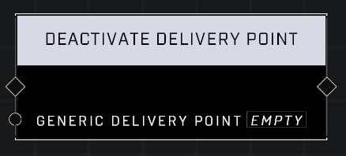

# Deactivate Delivery Point

## Description
Deactivates the *Delivery Point*. Use instead of **Delete Object** to avoid breaking references.

## Node Type
Nodes fall into two basic categories: Data and Execution. This node Executes a function directly in the node string.

## Inputs
| Input | Type | Required | Description |
|------------------|------------------|----------|--------------------------------------------------------------|
| Generic Delivery Point | Object | Yes | Which Generic Delivery Point will be deactivated. |

## Outputs
| Output | Type | Description |
|------------------|------------------|--------------------------------------------------------------|
| N/A | N/A | N/A |

\
\
**Contributors**

AddiCt3d 2CHa0s