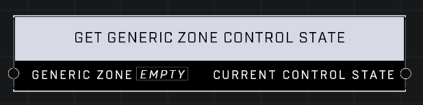

# Get Generic Zone Control State

## Description
Returns the current Control State from the Generic Zone object.

## Node Type
Nodes fall into two basic categories: Data and Execution. This node supplies Data for an Execution node.

## Inputs
| Input | Type | Required | Description |
|------------------|------------------|----------|--------------------------------------------------------------|
| Generic Zone | Object | Yes | Which Generic Zone to get control state from. |

## Outputs
| Output | Type | Description |
|------------------|------------------|--------------------------------------------------------------|
| Current Control State | Control State | What control state the generic zone from input pin is currently in. |

\
\
**Contributors**

AddiCt3d 2CHa0s