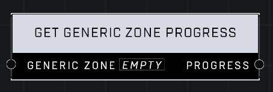

# Get Generic Zone Progress

## Description
Returns the current capture progress from the Generic Zone object

## Node Type
Nodes fall into two basic categories: Data and Execution. This node supplies Data for an Execution node.

## Inputs
| Input | Type | Required | Description |
|------------------|------------------|----------|--------------------------------------------------------------|
| Generic Zone | Object | Yes | Which Generic Zone to get progress from. |

## Outputs
| Output | Type | Description |
|------------------|------------------|--------------------------------------------------------------|
| Progress | Number | Current capture progress for the zone. |

\
\
**Contributors**

AddiCt3d 2CHa0s