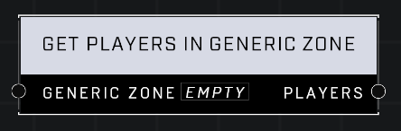

# Get Players In Generic Zone

## Description
Creates an object list that contains all of the players currently within the *Generic Zone*'s boundary. The zone must be active (incoming or capturable) to return players.

## Node Type
Nodes fall into two basic categories: Data and Execution. This node supplies Data for an Execution node.

## Inputs
| Input | Type | Required | Description |
|------------------|------------------|----------|--------------------------------------------------------------|
| Generic Zone | Object | Yes | Which Generic Zone to get players from. |

## Outputs
| Output | Type | Description |
|------------------|------------------|--------------------------------------------------------------|
| Players | Object List | List of all players currently in the zone. |

\
\
**Contributors**

AddiCt3d 2CHa0s