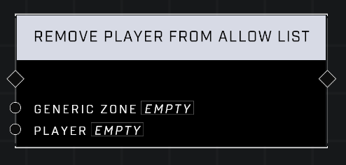

# Remove Player From Allow List

## Description
Removes player from the *Generic Zone*'s Allow List which determines who is able to capture the zone. This only works if the *Generic Zone*'s **Restrict Capture** property is set to Allow List.

## Node Type
Nodes fall into two basic categories: Data and Execution. This node Executes a function directly in the node string.

## Inputs
| Input | Type | Required | Description |
|------------------|------------------|----------|--------------------------------------------------------------|
| AI Spawner | AI Spawner | Yes | Which AI Spawner to override. |
| Squad Tier | Number | Yes | Squad health and damage level (1-5) |
| Squad Intensity | Number | Yes | Squad attack level (1-3) |

## Outputs
| Output | Type | Description |
|------------------|------------------|--------------------------------------------------------------|
| Squad Definition | Squad Definition | New squad definition for the AI Spawner in the input pin. |

\
\
**Contributors**

AddiCt3d 2CHa0s