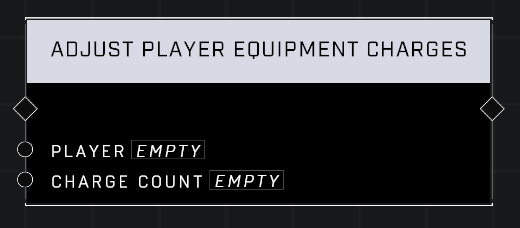

# Adjust Player Equipment Charges

## Description
Adjusts the number of equipment charges remaining on the *Player*'s equipment. Negative values will subtract charges.

## Node Type
Nodes fall into two basic categories: Data and Execution. This node Executes a function directly in the node string.

## Inputs
| Input | Type | Required | Description |
|------------------|------------------|----------|--------------------------------------------------------------|
| Player | Object | Yes | Which player to adjust charges for. |
| Charge Count | Number | Yes | How many charges to give or take away from player. |

## Outputs
| Output | Type | Description |
|------------------|------------------|--------------------------------------------------------------|
| N/A | N/A | N/A |

\
\
**Contributors**

AddiCt3d 2CHa0s

