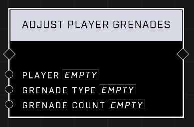

# Adjust Player Grenades

## Description
Adjusts the number of grenades in the *Player*'s inventory. Negative values will subtract grenades. Doesn't work with AI units.

## Node Type
Nodes fall into two basic categories: Data and Execution. This node Executes a function directly in the node string.

## Inputs
| Input | Type | Required | Description |
|------------------|------------------|----------|--------------------------------------------------------------|
| Player | Object | Yes | Which player to give ammo to. |
| Grenade Type | Grenade Type | Yes | What type of grenade to adjust count of. |
| Refill Percent | Number | Yes | How many grenades to give or take from player. |

## Outputs
| Output | Type | Description |
|------------------|------------------|--------------------------------------------------------------|
| N/A | N/A | N/A |

\
\
**Contributors**

AddiCt3d 2CHa0s
