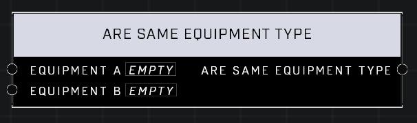

# Are Same Equipment Type

## Description
Returns whether the two objects share an *Equipment Type* (e.g. both are Grappleshots). Two objects with invalid *Equipment Types* will compare as true.

## Node Type
Nodes fall into two basic categories: Data and Execution. This node supplies Data for an Execution node.

## Inputs
| Input | Type | Required | Description |
|------------------|------------------|----------|--------------------------------------------------------------|
| Equipment A | Equipment Type | Yes | An Equipment to compare type to. |
| Equipment B | Equipment Type | Yes | An Equipment to compare type to. |

## Outputs
| Output | Type | Description |
|------------------|------------------|--------------------------------------------------------------|
| Are Same Equipment Type | Boolean | True if both Equipment are the same type. |

\
\
**Contributors**

AddiCt3d 2CHa0s